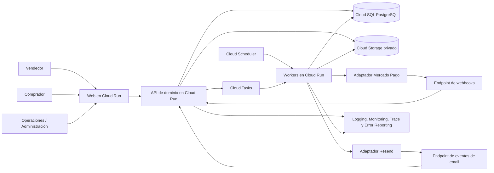
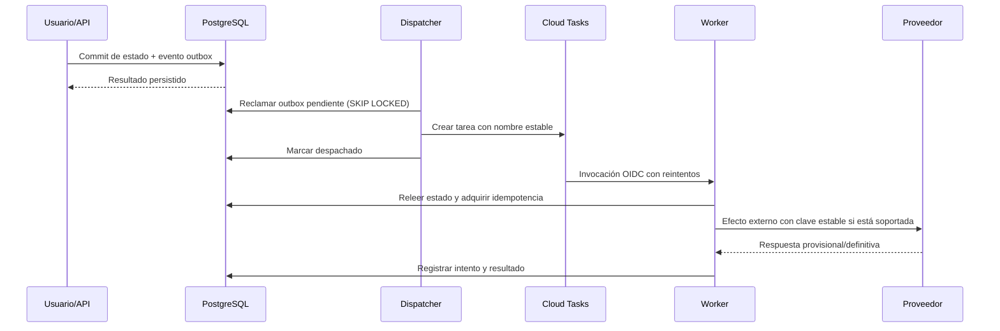
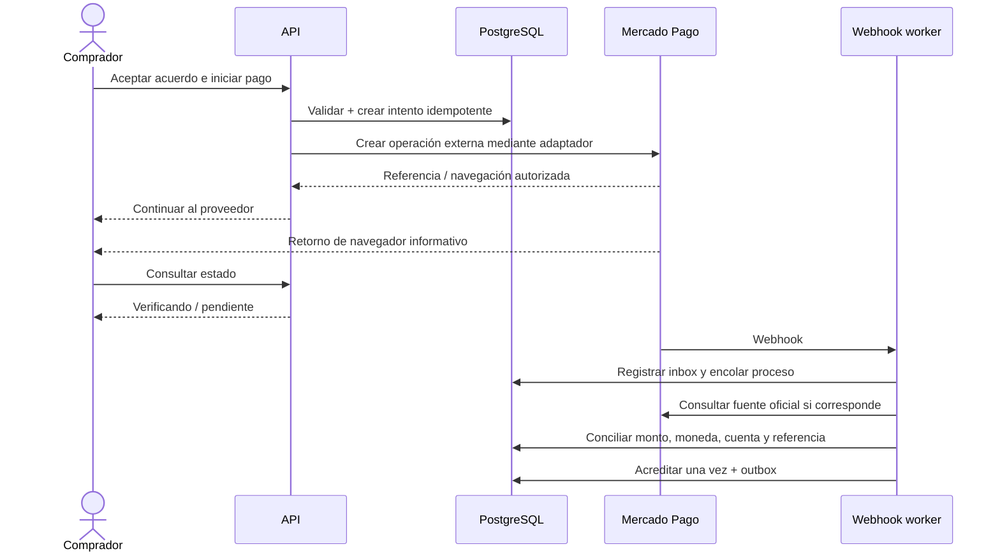
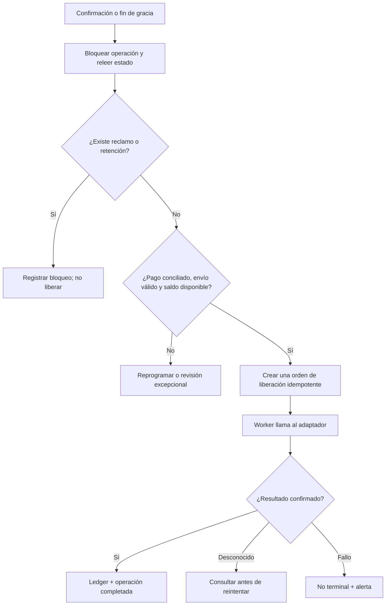
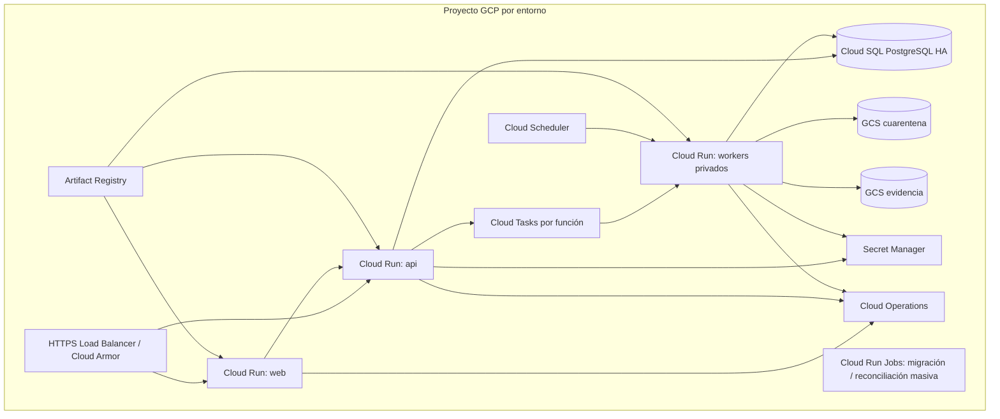

# 05 — Arquitectura técnica e implementación

**Estado:** Borrador técnico para revisión  
**Versión:** 0.1.4  
**Última actualización:** 2026-08-07  
**Documentos fuente:** `01_PRD.md`, `02_FSD.md`, `03_DOMAIN_AND_STATE_MACHINES.md`, `06_DATA_AND_API_CONTRACTS.md` y `07_PAYMENTS_DISPUTES.md`, todos v0.1.1  
**Audiencia:** Ingeniería, Arquitectura, SRE/Plataforma, Seguridad, QA, Producto, Operaciones, Riesgo y Pagos  
**Carácter:** Fuente de verdad técnica subordinada al PRD y al FSD  

> Este documento define una arquitectura recomendada y evolutiva para el MVP. No confirma capacidades comerciales, legales ni técnicas de Mercado Pago, Resend u otros proveedores. Todo comportamiento que dependa de una decisión `DP-*` permanece configurable, bloqueado por capacidad o sujeto a validación explícita. Ante contradicción prevalecen la ley y contratos aplicables, luego el PRD, el FSD y finalmente este documento.

## 1. Propósito y alcance

La arquitectura debe permitir construir y operar una aplicación de compra segura entre particulares que:

- procese acuerdos, pagos, envíos, disputas, devoluciones y reputación con trazabilidad completa;
- evite efectos financieros duplicados ante reintentos, webhooks repetidos, tareas tardías y fallas parciales;
- se despliegue en Google Cloud Run y pueda crecer por país sin bifurcar el dominio;
- encapsule Mercado Pago y Resend detrás de adaptadores sustituibles;
- almacene dinero, políticas, evidencia, decisiones y auditoría sin pérdida de historia;
- mantenga las decisiones regulatorias y de proveedor abiertas como capacidades configuradas, no como supuestos codificados.

Este documento cubre stack recomendado, componentes, límites del dominio, infraestructura, flujos síncronos y asíncronos, seguridad, consistencia, observabilidad, despliegue, recuperación y evolución. Los esquemas exactos y contratos HTTP pertenecen a `06_DATA_AND_API_CONTRACTS.md`; el detalle contable y del proveedor, a `07_PAYMENTS_DISPUTES.md`; el modelo de amenazas, a `08_SECURITY_AUDIT_ACCEPTANCE.md`.

## 2. Principios arquitectónicos

1. **Dominio antes que proveedor.** Los estados internos no son una copia de estados de Mercado Pago o Resend.
2. **Monolito modular primero.** Un único backend de dominio, con límites internos estrictos y despliegues separados por perfil, evita coordinación distribuida innecesaria en el MVP.
3. **Base transaccional como autoridad interna.** PostgreSQL conserva hechos, estados, ledger, políticas, idempotencia y outbox. Un resultado externo se confirma mediante webhook autenticado **o** consulta autoritativa y siempre se reconcilia; el retorno del navegador nunca es fuente de verdad.
4. **Efectos externos después del commit.** Ningún email, tarea o llamada de proveedor se considera parte de una transacción de base de datos; se usa outbox y procesamiento idempotente.
5. **Estados financieros provisionales.** Una respuesta síncrona o un retorno del navegador nunca convierten por sí solos un movimiento en definitivo.
6. **Inmutabilidad selectiva.** Acuerdos, evidencia original, versiones de política, fallos, ledger y auditoría se anexan; las correcciones crean nuevas versiones o eventos.
7. **Configuración segura.** Países, monedas, comisiones, plazos y capacidades se activan por políticas versionadas y matrices de disponibilidad con denegación por defecto.
8. **UTC y unidades menores.** Instantes en UTC; importes enteros con código ISO 4217 y regla de redondeo explícita.
9. **Mínimo privilegio y privacidad.** Autorización por recurso en servidor, cuentas de servicio separadas, upload temporal restringido, lectura sensible por gateway y datos minimizados.
10. **Operación observable.** Cada efecto crítico tiene correlación, métricas, alertas, historial de intentos y ruta de recuperación.

## 3. Decisión arquitectónica recomendada

### 3.1 Estilo

Se recomienda un **monolito modular TypeScript** con tres perfiles desplegables y un repositorio único:

- **Web:** aplicación Next.js mobile-first, renderizada desde Cloud Run, para usuarios y consola administrativa.
- **API:** aplicación Node.js con NestJS y adaptador HTTP Fastify, organizada por módulos de dominio.
- **Worker:** el mismo núcleo de aplicación, sin endpoints públicos, ejecutando tareas asíncronas, conciliación, notificaciones y procesamiento de archivos.

La separación es de ejecución, escalado e IAM; no son microservicios autónomos. Web, API y workers comparten contratos de dominio y librerías, pero solo el API y los workers acceden a la base de datos. El navegador nunca accede directamente a PostgreSQL ni recibe credenciales de proveedores.

**Motivo:** el sistema exige transacciones fuertes entre operación, retenciones, órdenes financieras, ledger y outbox. Separar esos conceptos en microservicios desde el MVP aumentaría fallas distribuidas sin una necesidad de escala demostrada.

### 3.2 Stack recomendado

| Capa | Elección recomendada | Motivo | Alternativa futura |
|---|---|---|---|
| Lenguaje | TypeScript estable soportado por el runtime elegido | Unifica web, API, workers y tipos | Otro lenguaje por módulo si existe razón operativa |
| Web | Next.js con catálogo i18n externo a componentes | SSR/streaming, rutas públicas y autenticadas, UX responsive | SPA estática + BFF |
| API | NestJS sobre Fastify | Módulos, validación, interceptores y pruebas | Fastify directo |
| Persistencia | PostgreSQL en Cloud SQL | ACID, bloqueos, constraints, JSONB controlado y consultas operativas | AlloyDB cuando la escala lo justifique |
| Acceso a datos | SQL explícito o ORM con migraciones revisables; recomendación: Prisma para CRUD y SQL para locking/ledger | Productividad sin ocultar operaciones críticas | Drizzle/Knex/repositorios propios |
| Archivos | Cloud Storage, buckets privados | Objetos grandes fuera de DB, versionado y lifecycle | Proveedor compatible mediante interfaz |
| Tareas | Cloud Tasks por colas + Cloud Scheduler para barridos y conciliación | Entrega con reintentos y programación; invocación privada a Cloud Run | Pub/Sub para fan-out posterior |
| Eventos internos | Outbox transaccional en PostgreSQL | Atomicidad entre cambio de dominio y trabajo pendiente | CDC/event bus en una etapa posterior |
| Correo | Adaptador `EmailProvider`, implementación inicial Resend | Evita acoplar plantillas y estados del dominio | Segundo proveedor por país/failover |
| Pagos | Puertos de pagos y liquidación; adaptador inicial Mercado Pago | Aísla diferencias por país/cuenta/modelo | Adaptadores adicionales |
| Infraestructura | Terraform por entorno | Cambios revisables, repetibles y auditables | Pulumi si el equipo lo estandariza |
| CI/CD | Cloud Build o GitHub Actions con Workload Identity Federation | Sin claves estáticas, promoción controlada | Herramienta corporativa aprobada |

Las versiones exactas se fijarán en el repositorio y se mantendrán con política de actualización. La selección de ORM no autoriza usar operaciones de lectura-modificación-escritura sin bloqueo en transiciones financieras.

## 4. Vista de contexto



### 4.1 Flujo de red recomendado

- Cloud Load Balancing expone el dominio público, termina TLS y aplica Cloud Armor cuando esté habilitado.
- `web` y los endpoints públicos mínimos de `api` aceptan tráfico externo; los endpoints de workers y administración interna requieren identidad y políticas específicas.
- Cloud Tasks y Cloud Scheduler invocan Cloud Run con tokens OIDC de cuentas de servicio dedicadas.
- Cloud SQL usa IP privada a través de conectividad VPC. El acceso público queda deshabilitado salvo excepción temporal aprobada.
- Cloud Storage permanece privado. Las cargas pueden usar URLs firmadas de corta duración, alcance de objeto único y límites estrictos. La lectura de evidencia sensible pasa por un gateway/proxy autenticado que vuelve a autorizar por recurso y registra al actor; no se atribuye una descarga humana a quien recibió una URL bearer.
- Las salidas hacia Mercado Pago y Resend atraviesan rutas controladas. Si se requiere una IP de egreso estable, se incorpora VPC egress + Cloud NAT; no se presupone que el proveedor lo exija.

## 5. Componentes y responsabilidades

### 5.1 Web

Responsable de presentación, navegación, internacionalización, accesibilidad, cookies de sesión y llamadas al API. Incluye:

- acceso por magic link y continuación segura;
- dashboards de compras, ventas y reclamos;
- creación/revisión de solicitudes;
- pagos mediante el mecanismo aprobado por el proveedor;
- carga directa de evidencia con sesión de carga autorizada;
- detalle, línea de tiempo, confirmación, reclamo y reputación;
- consola administrativa con rutas y componentes protegidos.

La web no decide permisos, elegibilidad, comisiones, vencimientos ni transiciones. Puede anticipar validaciones para UX, pero el API siempre revalida.

### 5.2 API de dominio

Expone contratos versionados y ejecuta comandos y consultas. Sus responsabilidades son:

- autenticación, sesión y autorización por recurso;
- validación de comandos y control de concurrencia;
- resolución y congelación de políticas;
- transiciones del dominio y escritura de eventos/auditoría;
- emisión de sesiones de carga y finalización de evidencia;
- creación de intentos y órdenes financieras;
- recepción segura de webhooks;
- consultas de dashboards, perfiles y administración;
- escritura atómica de outbox con el cambio de negocio.

### 5.3 Workers

Procesan tareas idempotentes y nunca confían en el estado incluido en un mensaje antiguo. Cada ejecución relee la operación y su política congelada antes de actuar. Perfiles lógicos:

- `outbox-dispatcher`: reclama eventos pendientes y crea tareas;
- `payments-worker`: crea/consulta movimientos y reconcilia proveedor;
- `notification-worker`: renderiza plantillas versionadas y envía email/in-app;
- `deadline-worker`: expira, recuerda, evalúa liberación y aplica consecuencias explícitas;
- `evidence-worker`: valida tipo real, hash, metadatos, análisis antimalware y promoción desde cuarentena;
- `reputation-worker`: publica calificaciones elegibles y recalcula agregados;
- `reconciliation-worker`: compara órdenes/ledger con proveedor y crea alertas.

En el MVP pueden ser rutas privadas del mismo artefacto desplegadas como uno o pocos servicios. Se separan físicamente solo si volumen, seguridad o perfil de CPU/memoria lo justifican.

### 5.4 Persistencia

Cloud SQL PostgreSQL contiene:

- identidades, sesiones y consentimientos;
- operaciones, acuerdos versionados y participantes;
- políticas, ámbitos, versiones y snapshots efectivos;
- intentos de pago, órdenes financieras, retenciones y ledger append-only;
- envíos, tracking versionado, disputas, devoluciones y reputación;
- metadatos de evidencia, no sus binarios;
- auditoría, idempotencia, inbox de webhooks, outbox y estado de tareas;
- notificaciones y estados de entrega.

Se recomienda instancia regional de alta disponibilidad para producción y edición adecuada a la carga inicial. La capacidad exacta depende del piloto y de `DP-020`.

### 5.5 Almacenamiento de evidencia

Separar al menos:

- **cuarentena:** cargas nuevas, inaccesibles para participantes;
- **evidencia validada:** originales inmutables o protegidos por retención/versionado;
- **derivados:** miniaturas o versiones de reproducción, recreables;
- **exportaciones temporales:** lifecycle corto y acceso excepcional.

El flujo de carga recomendado es: solicitar autorización al API → recibir URL firmada de carga limitada → cargar directamente → informar finalización → verificar objeto y propietario → analizar → calcular hash → promover o marcar rechazado. El estado del archivo debe ser `pending`, `scanning`, `accepted`, `rejected` o `restricted`; solo `accepted` es evidencia utilizable. La herramienta antimalware concreta y los límites de video son decisiones operativas a validar, no capacidades implícitas de Cloud Storage.

La descarga o visualización de evidencia sensible se realiza mediante un gateway autenticado. El gateway valida sesión, autorización sobre la operación, visibilidad, estado del archivo y propósito; registra actor y resultado, y transmite el objeto con headers seguros. Puede usar internamente una URL firmada o credencial de servicio sin exponerla al cliente. Una descarga directa con URL bearer solo se admite para contenido no sensible y tras aceptación explícita de que se audita la emisión, no la identidad de cada uso.

## 6. Límites del dominio

El backend se organiza en módulos con dependencias explícitas:

| Módulo | Autoridad | Puede depender de |
|---|---|---|
| Identity & Access | usuarios, magic links, sesiones, consentimientos, restricciones | Notification, Audit |
| Catalog & Eligibility | países, monedas, categorías, modalidades y capacidad habilitada | Policy, Payments capability |
| Policy | versiones, precedencia, vigencia, simulación y snapshots | Catalog, Audit |
| Operations | solicitud, acuerdo, participantes, línea de tiempo y estado agregado | Policy, Identity, Payments, Shipping, Disputes |
| Payments | intentos, órdenes, retenciones, conciliación y adaptador | Ledger, Provider adapters, Audit |
| Ledger | asientos inmutables y saldo atribuible por operación | Ningún proveedor directo |
| Shipping & Evidence | despacho, tracking, archivos y accesos | Storage adapter, Operations |
| Disputes & Returns | reclamos, evidencia bilateral, fallos y devolución | Operations, Payments, Evidence, Audit |
| Reputation | elegibilidad, calificaciones, moderación y agregados | Operations, Audit |
| Notification | preferencias, plantillas, entregas y adaptador de correo | Outbox, i18n |
| Audit & Compliance | eventos de auditoría y acceso sensible | Todos emiten; ninguno modifica historia |

Reglas de dependencia:

- Los adaptadores externos implementan puertos definidos por el dominio, nunca al revés.
- `Ledger` no consulta Mercado Pago; registra consecuencias financieras autorizadas por `Payments`.
- `Notification` no cambia estados de operación por éxito o falla de email.
- `Reputation` consume hechos terminales; no modifica operaciones.
- `Disputes` crea o remueve retenciones mediante comandos de dominio; no edita saldos.
- `Operations` expone una única transición autorizada para cada acción manual o automática; no existen endpoints de “editar estado”.

## 7. Consistencia, concurrencia e idempotencia

### 7.1 Límites transaccionales

Una transacción PostgreSQL debe incluir, cuando aplique:

1. bloqueo o validación optimista de la operación;
2. comprobación de invariantes y retenciones;
3. cambio de estado/subestado;
4. escritura de evento de dominio y auditoría;
5. creación de orden financiera o tarea lógica;
6. inserción en outbox.

La llamada al proveedor ocurre después del commit. Nunca se mantiene una transacción de base abierta durante una llamada de red.

### 7.2 Control de carreras

Para transiciones que compiten por fondos —abrir reclamo, confirmar recepción, autorizar liberación, emitir fallo y aplicar contracargo— se recomienda bloqueo de fila de la operación y constraints únicos sobre la acción. La transacción reevalúa:

- versión/estado vigente;
- payment acreditado y conciliado;
- retenciones activas;
- instante límite y calendario congelado;
- saldo disponible del ledger;
- órdenes equivalentes activas o completadas.

Esto implementa `RF-CON-006`, `RF-CON-007`, `RN-020`, `RN-021` y los casos límite 9, 10, 11 y 22 del FSD.

### 7.3 Idempotencia de API

- Los comandos con efecto aceptan `Idempotency-Key` por usuario, operación y tipo de comando.
- Se guarda hash canónico de la solicitud, resultado y expiración de la clave.
- Repetir la misma clave y payload devuelve el resultado previo.
- Repetir la misma clave con payload diferente devuelve conflicto.
- Además de la clave, constraints de negocio impiden dos acreditaciones, fallos finales u órdenes incompatibles.

### 7.4 Inbox de webhooks

Cada webhook se recibe en un endpoint mínimo que:

1. limita tamaño y tipo de contenido;
2. conserva cuerpo bruto cuando la política lo permita;
3. valida el mecanismo de autenticidad documentado por el proveedor para esa integración;
4. calcula la clave canónica `(provider, environment, account_scope, external_event_id)`;
5. inserta el evento en `webhook_inbox`;
6. responde rápido y deriva el procesamiento a una tarea.

Si el proveedor no ofrece un identificador estable suficiente, se usa el fallback `(provider, environment, account_scope, resource_reference, observed_type, payload_hash)`. Ese fallback solo deduplica la observación: la consulta autoritativa y conciliación son obligatorias antes de cualquier efecto financiero. Los eventos fuera de orden no degradan estados confirmados sin una transición explícita. El cuerpo no validado nunca autoriza directamente un movimiento.

### 7.5 Outbox transaccional



El dispatcher se invoca periódicamente mediante Cloud Scheduler y puede ejecutarse de forma oportunista tras un commit. Si falla entre crear la tarea y marcar el outbox, el nombre estable de la tarea y la idempotencia del worker evitan duplicar el efecto. Se mantiene un barrido de outbox estancado y una cola de errores operativa.

### 7.6 Garantía realista

Cloud Tasks, webhooks y redes entregan **al menos una vez**. La arquitectura no promete “exactly once” distribuido: logra **efecto de negocio a lo sumo una vez** mediante claves estables, constraints, ledger y reconciliación. Cuando el proveedor no soporte idempotencia para una operación, un timeout con resultado desconocido se consulta antes de reintentar.

## 8. Flujos críticos

### 8.1 Pago y acreditación



Si el webhook no llega o no contiene información suficiente, el worker consulta por la referencia persistida mediante el API autoritativo del proveedor. Webhook autenticado **o** consulta autoritativa pueden aportar la señal; en ambos casos la acreditación exige correlación y conciliación de monto, moneda, cuenta y operación. El retorno del navegador nunca acredita.

El adaptador debe preservar códigos y payloads externos necesarios para soporte, pero devolver al dominio un vocabulario estable. Acreditar exige evidencia verificable y reconciliada conforme al contrato real. `DP-002` y `DP-003` bloquean habilitar producción; no se presupone que Mercado Pago ofrezca custodia, split, marketplace, retención o liberación diferida de la forma requerida.

### 8.2 Confirmación o reclamo contra liberación automática



### 8.3 Evidencia

1. El API autoriza una carga para una operación, actor, propósito y límites concretos.
2. El cliente carga al bucket de cuarentena usando una URL temporal.
3. El worker verifica tamaño, MIME real, extensión, hash y estado del objeto; ejecuta análisis antimalware.
4. El resultado y metadatos se anexan a la evidencia. Un archivo rechazado permanece restringido según política de retención.
5. Solo evidencia aceptada se promueve al área validada y puede solicitarse mediante el gateway de lectura.
6. Cada visualización o descarga sensible se autentica, autoriza por recurso y audita en el gateway; una URL bearer no se considera ligada a un usuario.

No se sirven archivos con `Content-Disposition` o tipos peligrosos sin controles. Las previsualizaciones se generan en un entorno aislado y se consideran derivados, no originales.

### 8.4 Notificaciones y recordatorios

- El evento de dominio crea outbox con destinatario funcional y plantilla lógica, no HTML final.
- El worker resuelve idioma, versión de plantilla y parámetros permitidos en el momento de envío.
- Para comunicaciones legales se exige plantilla aprobada para país/idioma; sin ella la ruta queda bloqueada.
- La entrega a Resend usa una clave interna estable y registra intentos; se debe verificar durante la integración qué garantía de idempotencia ofrece la API usada.
- Los webhooks de entrega/rebote actualizan solo el estado de notificación y señales operativas.
- Los recordatorios se deduplican por `operación + tipo + hito + destinatario`.
- `DP-021` define por país qué estado/canal/fallback es requisito para una automatización crítica. Hasta aprobarla, el motor debe poder retener o escalar en vez de asumir que “aceptado por Resend” equivale a aviso efectivo.

## 9. Integraciones externas

### 9.1 Contrato del adaptador de pagos

El dominio depende de capacidades, no de endpoints concretos. Puertos mínimos propuestos:

- `getCapabilities(country, currency, account)`;
- `createPaymentIntent(command, idempotencyKey)`;
- `getPayment(externalReference)`;
- `createRelease(command, idempotencyKey)` solo si el modelo aprobado lo permite;
- `createRefund(command, idempotencyKey)`;
- `getMovement(externalReference)`;
- `verifyWebhook(headers, rawBody)`;
- `normalizeWebhook(rawEvent)`.

La matriz de capacidades debe distinguir por país, moneda, cuenta y entorno: creación de cobro, estados posibles, reembolso total/parcial, tiempo de reversión, notificación, claves idempotentes, retención/liberación, destino del payout, contracargo y conciliación. Una capacidad desconocida se considera **no disponible**.

### 9.2 Integración Mercado Pago

Antes de implementar el flujo productivo se requiere una prueba técnica y contractual por la combinación piloto (`DP-002`, `DP-003`). La prueba debe responder, con documentación contractual vigente:

- quién recibe y mantiene jurídicamente los fondos;
- cómo y cuándo quedan disponibles;
- si existe una instrucción separada de liberación y cuál es su irreversibilidad;
- qué cuentas, onboarding/KYC y consentimiento se requieren por parte;
- cómo se realizan reembolsos, contracargos, reservas y conciliación;
- qué identificadores, firmas, reintentos e idempotencia ofrece cada API;
- qué monedas, límites y países están permitidos;
- qué cambia entre sandbox y producción.

Hasta resolverlo, el adaptador puede implementarse contra dobles de prueba y una interfaz de capacidades, pero no debe simular que el dinero está protegido.

### 9.3 Integración Resend

El adaptador recibe plantilla lógica, locale, destinatario, parámetros permitidos y correlación. Conserva el identificador externo y normaliza estados de entrega. Requisitos operativos:

- dominio separado por entorno cuando sea posible;
- SPF, DKIM y DMARC validados antes del piloto;
- secretos en Secret Manager;
- suppression de rebotes/quejas y alertas para emails críticos;
- contenido sin evidencia adjunta ni datos financieros sensibles;
- webhook autenticado según el mecanismo documentado y probado;
- enlace a la app con autorización independiente del email.

## 10. Motor de políticas y capacidades

La configuración no debe resolverse con flags dispersos. Se recomienda un motor determinista con:

- estados canónicos `DRAFT`, `VALIDATED`, `PENDING_APPROVAL`, `SCHEDULED`, `ACTIVE`, `REPLACED`, `RETIRED`, correspondientes a `SM-POL`; no se colapsan etapas de validación o aprobación;
- ámbito global, país, país+moneda y país+moneda+categoría, más excepción aprobada;
- precedencia explícita y detección de solapamientos;
- simulación antes de publicar;
- snapshots inmutables vinculados a la operación;
- activación por fecha mediante job y lectura por instante efectivo;
- capacidad técnica del proveedor separada de política comercial.

La elegibilidad requiere intersección de política aprobada, capacidad técnica verificada y autorización legal/operativa. Si falta una, se deniega. El hito exacto del snapshot permanece abierto en `DP-005`.

## 11. Seguridad e IAM

### 11.1 Identidad de usuario

- Magic links con al menos 128 bits de entropía, un solo uso, hash resistente en DB, propósito y expiración.
- `GET` del enlace solo presenta una pantalla de continuación y NO consume el desafío; esto protege frente a prefetch/scanners de correo. El consumo atómico requiere interacción explícita mediante `POST`, sin cargar recursos externos ni filtrar el token.
- Respuesta neutral para evitar enumeración y rate limiting por IP, correo normalizado y dispositivo/señal cuando sea lícito.
- Sesión en cookie `HttpOnly`, `Secure`, `SameSite=Lax` o más estricta según flujo, rotación al autenticar y revocación server-side.
- Protección CSRF para comandos basados en cookie; CSP estricta, encoding contextual y validación contra XSS.
- Redirecciones solo a rutas relativas o allowlist interna.
- Autenticación reciente para fallos, cambios sensibles y acciones financieras administrativas.

### 11.1.1 Identidad administrativa

La administración queda **denegada por defecto** hasta resolver `DTA-SEC-001`. La decisión debe definir IdP corporativo, MFA resistente a phishing cuando sea viable, vinculación con identidad interna, separación de origen/dominio y cookies, duración y revocación de sesión, recent authentication, altas/bajas/cambios de rol, acceso temporal y procedimiento break-glass probado. Una cuenta participante autenticada por magic link no obtiene privilegios por compartir correo con una identidad administrativa.

### 11.2 Autorización

RBAC define capacidad administrativa y ABAC vincula actor, operación, rol, país y estado. Toda consulta y comando usa filtros de pertenencia en servidor; los identificadores no predecibles no sustituyen autorización. La consola administrativa debe admitir separación entre lectura, soporte, disputa, configuración, finanzas y aprobación secundaria.

### 11.3 Cuentas de servicio

Servicios recomendados:

- `web-runtime`: invocar API, sin DB ni secretos financieros;
- `api-runtime`: DB, buckets y secretos estrictamente necesarios;
- `task-enqueuer`: crear tareas, sin ejecutar movimientos;
- `worker-payments`: secretos de pagos, DB y cola de pagos;
- `worker-notifications`: secreto de Resend y cola de notificaciones;
- `worker-evidence`: acceso a cuarentena/validado, sin pagos;
- `scheduler-invoker`: invocar endpoints internos específicos;
- `deploy`: permisos de despliegue, sin usar credenciales de runtime.

Evitar roles básicos amplios. El acceso humano a producción usa grupos, MFA, acceso temporal y auditoría. No se descargan claves de cuentas de servicio.

### 11.4 Secretos y cifrado

- Secret Manager almacena credenciales, claves de webhook y material criptográfico; Cloud Run referencia versiones concretas o alias controlados.
- Rotación con periodo de superposición cuando el proveedor lo permita.
- TLS para tránsito y cifrado administrado en reposo. CMEK se evalúa por exigencia regulatoria, no se adopta sin necesidad operativa.
- PII sensible se separa lógicamente y se cifra a nivel de aplicación cuando el modelo de amenazas o la regulación lo exijan.
- Nunca se registran tokens, cuerpos completos con PII, URLs firmadas ni secretos.

### 11.5 Protección perimetral

- Cloud Armor, límites de tamaño, rate limiting y reglas de abuso en endpoints públicos.
- Webhooks en rutas dedicadas, sin sesión de usuario, con autenticación propia y allowlist solo si el proveedor mantiene rangos confiables.
- Validación SSRF para enlaces externos; el servidor no recupera URLs aportadas por usuarios salvo a través de un fetcher aislado con egress y DNS controlados.
- Dependencias y contenedores escaneados; imágenes por digest en producción.

El diseño detallado de amenazas y controles pertenece a `08_SECURITY_AUDIT_ACCEPTANCE.md`.

## 12. Observabilidad y operación

### 12.1 Correlación

Propagar `trace_id`, `request_id`, `operation_id` no sensible, `task_id`, `outbox_id`, `webhook_inbox_id` y `provider_reference` redactada. Cada log debe ser estructurado e incluir servicio, entorno, versión, evento, resultado y latencia.

### 12.2 Métricas mínimas

- solicitudes HTTP por resultado y percentiles de latencia;
- logins solicitados/consumidos/fallidos y rate limits;
- profundidad y antigüedad de outbox, colas y tareas;
- latencia y duplicados de webhooks;
- pagos pendientes/no conciliados por antigüedad;
- órdenes de liberación/reembolso por estado, reintentos y resultado desconocido;
- diferencias de ledger/proveedor y saldo fuera de invariantes;
- recordatorios esperados/enviados/deduplicados;
- archivos pendientes/rechazados y latencia de análisis;
- emails aceptados, entregados, rebotados o con queja;
- disputas por SLA y acciones administrativas pendientes;
- errores por país, moneda, versión y proveedor.

### 12.3 Alertas prioritarias

| Severidad | Condición inicial | Respuesta |
|---|---|---|
| P1 | Duplicado o exceso financiero confirmado; corrupción/inconsistencia de ledger; exposición de secretos | Detener automatización afectada, incident response inmediato |
| P1/P2 | Liberaciones o reembolsos con estado desconocido sobre umbral | Pausar reintento ciego, reconciliar y escalar |
| P2 | Webhooks o outbox envejecidos; conciliación atrasada; tareas críticas en DLQ | Recuperación operativa y análisis |
| P2 | Error sostenido de autenticación o proveedor | Degradar de forma segura y comunicar |
| P3 | Rebotes de emails críticos o procesamiento de evidencia demorado | Cola operativa y contacto alternativo permitido |

Los umbrales numéricos y SLO se definen en `DP-020`. Los dashboards deben separar salud técnica, salud financiera y SLA operativo.

### 12.4 Auditoría

Los eventos de auditoría son append-only y contienen actor, rol efectivo, recurso, acción, resultado, motivo, correlación y antes/después cuando aplica. El acceso a evidencia sensible también se registra. Se recomienda exportación periódica a un almacén con retención protegida y acceso separado; el mecanismo exacto depende de requisitos legales. Los logs de plataforma no sustituyen el registro de auditoría del dominio.

## 13. Entornos y configuración

Entornos mínimos:

- **local:** emuladores/dobles, datos sintéticos, sin credenciales productivas;
- **development:** integración continua y pruebas exploratorias;
- **staging:** topología equivalente a producción, cuentas sandbox y pruebas de migración/rollback;
- **production:** proyectos, datos, secretos, dominios y cuentas de proveedor separados.

Cada entorno debe usar un proyecto GCP independiente o una separación equivalente aprobada. No se copian datos productivos a entornos inferiores sin anonimización irreversible y autorización. Configuración no secreta se versiona; secretos y parámetros de lanzamiento se administran por entorno. Las banderas de funcionalidad no sustituyen la matriz de capacidades o las políticas financieras.

### 13.1 Relación con los releases

La secuencia y las autorizaciones normativas se definen en `09_RELEASE_STRATEGY.md` y `releases/RELEASE_STATUS.yaml`:

| Release | Runtime permitido | Proveedores permitidos |
|---|---|---|
| `R00`–`R02` | Estación local y PostgreSQL local | Fakes deterministas, sin credenciales ni red externa |
| `R03` | Local/CI autorizado para pruebas contractuales | Sandbox y email de prueba solo con autorizaciones explícitas |
| `R04` | Google Cloud staging aprobado | Cuentas sandbox segregadas; sin dinero real |
| `R05A` | Producción cerrada, sin cohorte | Una transacción real controlada y autorizada para producir evidencia `EXIT-003*` |
| `R05B` | Piloto de alcance cerrado | Capacidades `VERIFIED`, email productivo, todos los `EXIT-*` y go-live aprobados |

La topología Cloud Run de este documento no autoriza su creación anticipada. Codex no debe crear recursos GCP antes de `R04`, ni siquiera un entorno development, mientras `cloud_deployment_authorized` o la autorización específica sean `false`. El dominio, contratos, persistencia e interfaces deben completarse en R00–R02 mediante puertos y adaptadores locales intercambiables.

R05A utiliza el caso de verificación financiera de `07` §20.1 mediante un harness interno separado de las rutas del producto. La identidad, endpoints, cuotas y claves de idempotencia del harness no se reutilizan para participantes. La capacidad permanece `UNVERIFIED` durante la prueba y el harness no puede activar `TR-FIN-002`; una aprobación posterior publica, o no, una versión `VERIFIED` para R05B.

## 14. CI/CD, migraciones y rollback

### 14.1 Pipeline recomendado

1. Formato, lint, typecheck y pruebas unitarias.
2. Pruebas de contratos y módulos de dominio con IDs `RF-*`, `RN-*` y `CA-*`.
3. Pruebas de integración con PostgreSQL real y dobles de proveedor.
4. Análisis de dependencias, secretos, IaC e imagen de contenedor.
5. Construcción y firma local/CI una sola vez; publicación por digest en Artifact Registry únicamente desde R04 y con autorizaciones cloud/staging efectivas.
6. En R00–R03, ejecución local/CI sin despliegue cloud; publicación externa solo si la autorización del release lo permite.
7. Desde R04, despliegue al staging autorizado y pruebas end-to-end/migración.
8. Aprobación manual para producción en R05, con checklist legal/pagos cuando cambien capacidades o políticas.
9. Despliegue gradual por revisión de Cloud Run y monitoreo, solo con autorizaciones efectivas.
10. Promoción de tráfico o rollback a la revisión anterior sin recompilar el artefacto.

### 14.2 Migraciones expand/contract

- Las migraciones son artefactos versionados: R00–R03 las ejecutan localmente o en CI autorizado; desde R04 pueden ejecutarse como Cloud Run Job con identidad dedicada.
- Primero se agregan tablas/columnas compatibles; luego se despliega código que escribe ambos formatos si hace falta; se backfillea; después se cambia lectura; la eliminación ocurre en una versión posterior.
- No se mezclan migraciones destructivas con el primer despliegue que deja de usar el dato.
- Toda migración de ledger, estados o snapshots requiere verificación de invariantes y respaldo previo.
- Las migraciones fallidas detienen la promoción; nunca se “arreglan” editando producción manualmente sin registro.

### 14.3 Rollback

- El código vuelve a una revisión compatible de Cloud Run.
- La base de datos no se revierte destructivamente como mecanismo normal; se usan compatibilidad hacia atrás y migraciones compensatorias.
- Un cambio de política se retira o reemplaza para operaciones futuras; no altera snapshots existentes.
- Los movimientos externos no se revierten mediante rollback de software. Requieren conciliación y acción financiera explícita.
- La activación de país/proveedor tiene kill switch que impide nuevas operaciones sin cerrar o modificar silenciosamente las existentes.

## 15. Resiliencia y degradación segura

### 15.1 Proveedor de pagos no disponible

- Impedir nuevos intentos cuando no pueda establecerse un estado seguro.
- Mantener operaciones existentes como pendientes/no terminales.
- No instruir envío, liberar ni reembolsar por una suposición.
- Reconciliar con backoff y jitter; abrir alerta al superar la ventana.

### 15.2 Resend no disponible

- Persistir la notificación, reintentar de forma acotada y mostrar el evento en la app.
- La falla de email no reescribe hechos de negocio. Extender, retener o escalar una automatización depende exclusivamente de la política aprobada en `DP-021`; no se fija un default técnico.
- Los magic links no enviados permanecen inutilizables o expiran; no se marca entrega sin evento correspondiente.

### 15.3 Base de datos o colas degradadas

- El API falla cerrado para comandos financieros si no puede confirmar el commit.
- Las consultas pueden mostrar una pantalla de mantenimiento sin inventar estado.
- Cloud Tasks reintenta; los workers son idempotentes y tareas expiradas reevalúan condiciones.
- Una DLQ lógica conserva payload mínimo, causa, intentos y herramienta de replay autorizada.

### 15.4 Backpressure

Colas separadas para pagos, webhooks, deadlines, notificaciones y evidencia evitan que archivos o correo bloqueen movimientos críticos. Los workers establecen concurrencia acorde con límites de DB/proveedor. Priorizar webhooks financieros y vencimientos sobre emails informativos. Los límites exactos se obtienen por pruebas de carga.

## 16. Respaldo, recuperación y continuidad

### 16.1 Recomendación inicial

- Cloud SQL regional HA en producción, backups automáticos y recuperación a un punto en el tiempo.
- Exportaciones periódicas adicionales según retención y regulación.
- Versionado/lifecycle de buckets y protección contra borrado accidental donde corresponda.
- Infraestructura reproducible desde Terraform y artefactos inmutables en registro.
- Procedimientos para restaurar DB, reconstruir derivados y reconciliar efectos externos posteriores al punto restaurado.

### 16.2 RTO/RPO

Los objetivos numéricos permanecen abiertos en `DP-020`. Antes del piloto deben definirse por nivel:

- identidad y navegación;
- aceptación y nuevos pagos;
- webhooks, ledger, liberaciones y reembolsos;
- evidencia y disputas;
- reporting y reputación.

El RPO financiero deseado debe acercarse a cero mediante HA, WAL/PITR y reconstrucción desde proveedor/outbox, pero no se promete hasta probarlo. La recuperación no puede reejecutar efectos externos sin reconciliar primero.

### 16.3 Pruebas de restauración

Al menos trimestralmente antes y después del lanzamiento, o con frecuencia aprobada, ejecutar:

1. restauración aislada de PostgreSQL;
2. validación de constraints y balances del ledger;
3. recuperación de objetos de evidencia y metadatos;
4. replay controlado de outbox/inbox sin efectos externos reales;
5. conciliación de una muestra contra sandbox o exportación del proveedor;
6. medición real de RTO/RPO y registro de brechas.

## 17. Rendimiento y escalabilidad

### 17.1 Escalado inicial

- Cloud Run escala horizontalmente web, API y workers; fijar máximos para proteger Cloud SQL y proveedores.
- Usar pool de conexiones pequeño por instancia y un pooler administrado o compatible solo si se valida su comportamiento transaccional.
- Índices centrados en operación, participante, estado, deadline, país/moneda y colas administrativas.
- Consultas de dashboard usan paginación por cursor estable, no offset profundo.
- Evidencia se carga directamente a Storage, evitando atravesar instancias web/API.
- Agregados de reputación se materializan y recalculan desde calificaciones fuente.

### 17.2 Evolución

Extraer un módulo a servicio independiente solo cuando exista al menos una de estas señales:

- necesidad de aislamiento de seguridad o cumplimiento;
- perfil de escalado claramente distinto y costoso;
- equipo con ownership y ciclo de despliegue independiente;
- contención de DB demostrada;
- requerimiento de disponibilidad diferente.

Primeros candidatos: procesamiento de evidencia, notificaciones y conciliación. Ledger/Payments no se separan hasta disponer de un diseño formal de consistencia distribuida y reconciliación.

### 17.3 Datos analíticos

La analítica de producto no debe ejecutar consultas pesadas sobre la base transaccional. En una primera fase se exportan eventos minimizados a BigQuery mediante un pipeline asíncrono. Los identificadores seudónimos y reglas de retención deben definirse con Privacidad. BigQuery no es autoridad de estado ni ledger.

## 18. Modelo de despliegue



La topología final puede variar por restricciones de región y disponibilidad del país piloto. Todos los recursos que contienen datos se ubican en regiones aprobadas; la residencia de datos es una decisión legal y operativa, no una selección automática.

## 19. Estructura recomendada del repositorio

```text
apps/
  web/                 # Next.js, UI e i18n
  api/                 # API pública/administrativa y webhooks
  worker/              # handlers privados de tareas
  migrations/          # ejecutable de migraciones
packages/
  domain/              # entidades, value objects, políticas e invariantes
  application/         # comandos, consultas y casos de uso
  contracts/           # DTO y schemas versionados
  persistence/         # repositorios, transacciones y SQL crítico
  provider-payments/   # puertos + adaptador Mercado Pago
  provider-email/      # puertos + adaptador Resend
  storage/             # Upload firmado, gateway de lectura, metadatos y promoción
  observability/       # logging, tracing, métricas y redacción
  i18n/                # catálogos y validación de cobertura
infra/
  terraform/
docs/
tests/
  contract/
  integration/
  e2e/
```

Reglas de importación automáticas deben impedir que `domain` dependa de frameworks o SDKs externos. Los adaptadores traducen errores externos a categorías internas conservando la referencia original para soporte.

## 20. Estrategia de pruebas arquitectónicas

- **Dominio:** invariantes, políticas, dinero, calendarios y máquinas de estado con tests deterministas.
- **Concurrencia:** reclamo contra liberación, doble confirmación, webhooks fuera de orden y administradores concurrentes usando PostgreSQL real.
- **Idempotencia:** repetir cada comando, tarea y webhook; simular timeout después de aceptar un movimiento.
- **Contratos:** fixtures versionadas de proveedores y verificación de normalización; sandbox no sustituye casos sintéticos de error.
- **Persistencia:** constraints, ledger balanceado, outbox/inbox y migraciones desde la versión anterior.
- **Seguridad:** acceso cruzado, upload firmado, gateway de lectura, CSRF/XSS/SSRF, abuso de magic links y roles administrativos.
- **Archivos:** tipo falso, malware de prueba autorizado, carga parcial, objeto cambiado y archivo sobredimensionado.
- **Resiliencia:** proveedor lento, webhook ausente, cola duplicada, DB failover y DLQ/replay.
- **DR:** restauración y conciliación posterior.
- **Rendimiento:** flujo móvil, dashboards, bursts de webhooks y límite de conexiones de Cloud SQL.

Cada prueba de aceptación debe citar al menos un identificador `CA-*`; las pruebas de arquitectura deben citar además `RNF-*` o el ADR correspondiente.

## 21. Decisiones recomendadas y pendientes

### 21.1 Decisiones que este documento recomienda

| ID | Recomendación | Estado |
|---|---|---|
| AR-REC-001 | Monolito modular con web, API y workers como perfiles desplegables | Recomendada para MVP |
| AR-REC-002 | TypeScript, Next.js, NestJS/Fastify y PostgreSQL | Recomendada; ratificar por Ingeniería |
| AR-REC-003 | Cloud SQL PostgreSQL regional HA para producción | Recomendada; dimensionar tras piloto |
| AR-REC-004 | Cloud Tasks + Scheduler y outbox transaccional | Recomendada |
| AR-REC-005 | Cloud Storage privado con cuarentena y promoción | Recomendada |
| AR-REC-006 | Terraform, contenedores inmutables y despliegue gradual | Recomendada |
| AR-REC-007 | Sesión server-side con cookie segura para magic link | Recomendada |
| AR-REC-008 | Adaptadores por capacidad para Mercado Pago y Resend | Obligatoria por `RNF-010` |
| AR-REC-009 | Ledger append-only separado de analítica | Obligatoria por `RF-PAG-011` |
| AR-REC-010 | Un proyecto GCP por entorno y cuentas de servicio por función | Recomendada |

### 21.2 Decisiones del PRD que permanecen abiertas

| Decisión | Impacto técnico | Tratamiento hasta aprobación |
|---|---|---|
| `DP-001` país piloto/entidad | Región, residencia, dominio, textos y cuentas | Infra parametrizada; ningún país habilitado por defecto |
| `DP-002` modelo legal de fondos | API financiera, ledger y payout | Puerto abstracto; bloquear producción |
| `DP-003` capacidades Mercado Pago | Métodos, estados, idempotencia y webhooks | Matriz por cuenta/país probada y versionada |
| `DP-004` transfronterizo/conversión | Ledger multiimporte, FX y riesgo | Fuera del MVP; una moneda por operación |
| `DP-005` congelación | Momento del snapshot | Hito configurable; no asumir aceptación en código |
| `DP-006` costo de reclamo | Orden adicional y tratamiento contable | Modelo extensible; no cobrar hasta aprobar |
| `DP-007` comisiones por resultado | Reglas de settlement/refund | Tabla de resolución obligatoria |
| `DP-008..010` plazos/calendario | Deadline engine | Policy snapshot; valores de prueba no productivos |
| `DP-011..013` categorías/KYC/riesgo | Elegibilidad, retenciones y onboarding | Hooks y estados; proveedor/rules aún abiertos |
| `DP-014..016` SLA/devolución | Scheduler, estados y órdenes | Consecuencia expresada en fallo/política |
| `DP-017..018` reputación/moderación | Agregados, ventana y retención | Parámetros y flujo humano configurables |
| `DP-019` stack | Elecciones de este documento | Aprobar ADR-001 a ADR-006 |
| `DP-020` SLO/RTO/RPO | Capacidad, alertas, HA y DR | Medir piloto y aprobar antes de go-live |
| `DP-021` eficacia de notificaciones críticas | Automatización, rebotes, fallback y prueba de aviso | Política por país; retener/escalar cuando falte la condición aprobada |

### 21.3 Decisiones técnicas adicionales pendientes

| ID | Decisión | Responsable | Bloquea |
|---|---|---|---|
| DTA-001 | Región GCP y requisitos de residencia por país | Legal/Plataforma | Provisionamiento productivo |
| DTA-002 | Motor antimalware, límites de archivo y tratamiento de video | Seguridad/Operaciones | Evidencia productiva |
| DTA-003 | Cloud Build vs. GitHub Actions y repositorio fuente | Ingeniería | Pipeline definitivo |
| DTA-004 | ORM final y convención de SQL crítico | Ingeniería | Scaffold de persistencia |
| DTA-005 | Proveedor de analítica y consentimiento | Producto/Privacidad | Métricas no esenciales |
| DTA-006 | CMEK y cifrado de campos PII | Seguridad/Legal | Controles avanzados |
| DTA-007 | Herramienta de soporte/on-call y canales de alerta | Operaciones/SRE | Runbooks productivos |
| DTA-008 | Retención de DB, logs, auditoría y objetos por país | Legal/Privacidad | Lifecycle y borrado |
| `DTA-SEC-001` | IdP corporativo administrativo, MFA, sesiones/origen separado, lifecycle y break-glass | Seguridad/IT/Legal | Consola administrativa productiva; deny-by-default |

## 22. ADR propuestos

Crear los siguientes ADR antes de iniciar la implementación irreversible:

| ADR | Título | Decisión principal | Estado propuesto |
|---|---|---|---|
| ADR-001 | Monolito modular y límites | No adoptar microservicios en MVP | Propuesto |
| ADR-002 | Stack TypeScript y contratos | Next.js + NestJS/Fastify + schemas compartidos | Propuesto |
| ADR-003 | Persistencia y ledger | PostgreSQL/Cloud SQL, ACID, append-only y constraints | Propuesto |
| ADR-004 | Procesamiento asíncrono | Outbox + Cloud Tasks + Scheduler | Propuesto |
| ADR-005 | Evidencia segura | GCS privado, cuarentena, scanner, upload firmado y lectura sensible por gateway | Propuesto |
| ADR-006 | Identidad passwordless | Token hash + sesión server-side + cookie segura | Propuesto |
| ADR-007 | Adaptador de pagos por capacidades | Mercado Pago no penetra el dominio | Bloqueado por `DP-002/003` |
| ADR-008 | Estrategia multi-país | Matriz de capacidad + política + aprobación | Propuesto |
| ADR-009 | Observabilidad financiera | Correlación, alertas y reconciliación separadas | Propuesto |
| ADR-010 | Recuperación y replay | Restaurar, reconciliar y luego reanudar efectos | Bloqueado por `DP-020` |

Cada ADR debe incluir contexto, opciones, decisión, consecuencias, riesgos, evidencia de prueba y fecha de revisión. Aprobar una recomendación de este documento no resuelve automáticamente una `DP-*` de negocio o legal.

## 23. Dependencias y gates de salida

Los gates de esta sección se aplican dentro de la progresión definida por `09_RELEASE_STRATEGY.md`. Un gate técnico satisfecho no cambia por sí solo `RELEASE_STATUS.yaml`, no autoriza gasto y no habilita el entorno siguiente.

### 23.1 Dependencias externas

- aprobación legal/regulatoria y de privacidad por país;
- contrato y cuenta Mercado Pago compatibles con el modelo aprobado;
- matriz de capacidades probada en sandbox y producción controlada;
- cuenta Resend, dominio y autenticación de correo configurados;
- proyecto GCP, facturación, organización, IAM y región aprobados;
- políticas KYC/AML, riesgo, contracargo, retención y categorías;
- equipo de operaciones para disputas y respuesta a incidentes;
- traducciones legales aprobadas en español y portugués brasileño.

### 23.2 Gates técnicos antes de producción

1. `DP-001`, `DP-002`, `DP-003`, `DP-011`, `DP-012`, `DP-013`, `DP-020`, `DP-021` y `DTA-SEC-001` aprobadas en lo necesario para el piloto; sin `DTA-SEC-001` la consola permanece deshabilitada.
2. Prueba end-to-end de pago, acreditación, liberación/reembolso y conciliación con la cuenta real controlada.
3. Demostración de que retorno de navegador, duplicado y webhook fuera de orden no acreditan dos veces.
4. Prueba de carrera reclamo/liberación y balance de ledger.
5. Restauración de DB/evidencia y replay controlado exitosos.
6. IAM, secretos, CSP, rate limits, escaneo de archivos y auditoría revisados.
7. Alertas, runbooks, on-call y kill switches probados.
8. Migración y rollback de aplicación verificados en staging.
9. Cobertura completa de idioma y textos legales para la combinación piloto.
10. Prueba de carga acorde a objetivos aprobados y límites de conexiones/proveedores.

## 24. Trazabilidad PRD/FSD → arquitectura

| Requisito / flujo | Decisión o componente arquitectónico |
|---|---|
| `RF-AUT-001..005`, `FL-01` | Identity & Access, token hash, sesión server-side, Resend, rate limiting |
| `RF-PER-001..004` | Identity, ABAC/RBAC, vistas públicas minimizadas |
| `RF-OPS-001..011`, `FL-02` | Operations, Policy snapshots, transacciones y outbox |
| `RF-PAG-001..012`, `FL-03`, `FL-10` | Payments adapter, inbox de webhook, órdenes, ledger, conciliación |
| `RF-ENV-001..007`, `FL-04` | Storage privado, cuarentena, scanner, metadata/hash y tracking versionado |
| `RF-CON-001..007`, `FL-05` | Deadline worker, Cloud Tasks, locks, retenciones e idempotencia |
| `RF-DAS-001..006`, `FL-12` | API de consultas, índices y paginación por cursor |
| `RF-DIS-001..015`, `FL-06..08` | Disputes, evidencia bilateral, retenciones, doble control y auditoría |
| `RF-DEV-001..008`, `FL-09` | Returns, tareas por hito y orden de reembolso condicionada |
| `RF-REP-001..011`, `FL-11` | Reputation, publicación asíncrona y agregados reproducibles |
| `RF-ADM-001..010`, `FL-13..14` | Policy engine, consola RBAC, diff/versiones, auditoría append-only |
| `AU-001..015`, FSD §20 | Scheduler, Cloud Tasks, workers idempotentes y barridos |
| FSD §21 | Notification module, plantillas versionadas y estados Resend |
| FSD §22 | Catálogos i18n, ISO 4217, UTC y matriz de disponibilidad |
| `RNF-001..003` | Next.js mobile-first, accesibilidad y budgets de rendimiento |
| `RNF-004..005` | Outbox/inbox, reconciliación y Cloud Operations |
| `RNF-006..008` | IAM, cifrado, Storage privado y auditoría inmutable |
| `RNF-009` | Cloud Run, IaC, entornos, migraciones y rollback |
| `RNF-010` | Puertos/adaptadores de pagos y correo |
| `RNF-011` | HA, backups, PITR y pruebas de restauración |
| `RNF-012` | Seguridad de sesión/webhooks, Cloud Armor y supply chain |

## 25. Invariantes técnicas obligatorias

1. Ningún importe financiero usa punto flotante.
2. Una operación mantiene una sola moneda y exactamente un comprador y vendedor.
3. Un retorno del navegador no acredita, libera ni reembolsa.
4. No se instruye despacho sin pago acreditado y conciliado.
5. Un reclamo válido o retención activa impide crear o autorizar una liberación.
6. Una orden financiera no supera el saldo atribuible a la operación.
7. Un efecto externo se intenta desde una orden persistida con clave idempotente.
8. Un timeout de resultado desconocido se consulta antes de reintentar.
9. Una tarea tardía relee estado y política antes de actuar.
10. Acuerdo, snapshot de política, evidencia original, fallo, ledger y auditoría no se sobrescriben.
11. Una combinación país/moneda/proveedor incompleta está deshabilitada.
12. Solo una transición de dominio autorizada cambia el estado; no existe edición directa.
13. Fallas de email no cambian hechos financieros.
14. Analítica y logs no son fuentes de verdad.
15. La restauración no reejecuta efectos externos hasta completar conciliación.

## 26. Próximos pasos recomendados

1. Iniciar `R00_LOCAL_FOUNDATION.md` y mantener todas las autorizaciones externas en `false`.
2. Aprobar o ajustar ADR-001 a ADR-006 para resolver la parte técnica de `DP-019` sin bloquear trabajo local reversible.
3. Completar R01 y R02 con fakes contractualmente fieles antes de conectar proveedores.
4. Definir con Seguridad el scanner y ciclo de evidencia (`DTA-002`) mediante un puerto local antes de elegir servicio cloud.
5. Ejecutar el spike de Mercado Pago/Resend únicamente en R03 y con las autorizaciones sandbox correspondientes.
6. Definir SLO/RTO/RPO, región y presupuesto (`DP-020`, `DTA-001`) antes de autorizar R04.
7. Crear recursos Google Cloud recién en R04; usar R05A solo para la verificación productiva cerrada y R05B para el piloto firmado.

---

### Registro de cambios

| Versión | Fecha | Cambio |
|---|---|---|
| 0.1.4 | 2026-08-07 | Aísla el harness R05A para obtener evidencia productiva sin habilitar transiciones ordinarias ni promover capacidades automáticamente |
| 0.1.3 | 2026-08-07 | Separa R05A/R05B, limita Artifact Registry/Cloud Run Jobs a releases autorizados y alinea estados de políticas con `SM-POL` |
| 0.1.2 | 2026-08-07 | Alinea entornos, CI/CD y próximos pasos con releases R00–R05; prohíbe recursos GCP antes de R04 sin autorización |
| 0.1.1 | 2026-08-07 | Alineación de acreditación, gateway de evidencia, magic link resistente a prefetch, identidad administrativa, `DP-021` y próximos pasos |
| 0.1.0 | 2026-08-07 | Primera arquitectura técnica derivada del PRD 0.1.0 y FSD 0.1.0 |
